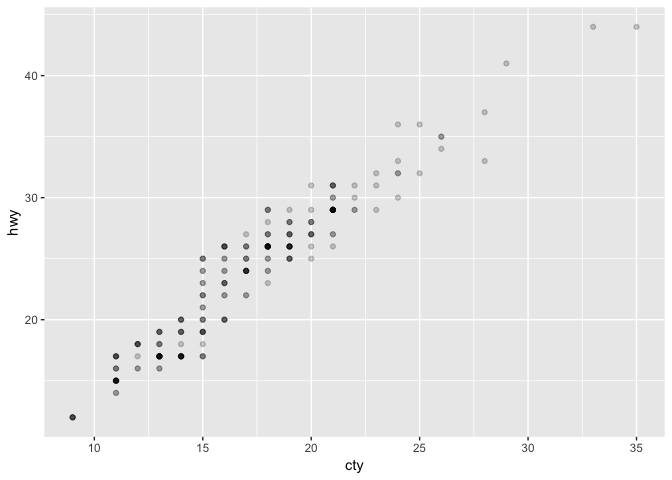

Getting Started with R and RStudio (solutions)
================

<!-- This file by Charlotte Wickham is licensed under a Creative Commons Attribution 4.0 International License. -->
``` r
library(tidyverse)
```

    ## ── Attaching packages ─────────────────────────────────── tidyverse 1.2.1 ──

    ## ✔ ggplot2 3.0.0     ✔ purrr   0.2.5
    ## ✔ tibble  1.4.2     ✔ dplyr   0.7.5
    ## ✔ tidyr   0.8.1     ✔ stringr 1.3.1
    ## ✔ readr   1.1.1     ✔ forcats 0.3.0

    ## ── Conflicts ────────────────────────────────────── tidyverse_conflicts() ──
    ## ✖ dplyr::filter() masks stats::filter()
    ## ✖ dplyr::lag()    masks stats::lag()

R Markdown
----------

This is an [R Markdown](http://rmarkdown.rstudio.com) file (it has a .Rmd file extension). When you execute code within the file, the results appear beneath the code.

R code goes in **code chunks**, denoted by three backticks. Try executing this chunk by clicking the *Run* button (a small green triangle) within the chunk or by placing your cursor inside it and pressing *Ctrl+Shift+Enter* (or *Cmd+Shift+Enter* on Mac).

``` r
ggplot(data = mpg) +
  geom_point(mapping = aes(x = cty, y = hwy), alpha = 0.2)
```



Add a new code chunk
--------------------

Add a new code chunk by clicking the *Insert Chunk* button on the toolbar or by pressing *Cmd/Ctrl+Option+I*.

Put 2 + 2 in your new code chunk and run it.

``` r
2 + 2
```

    ## [1] 4

Knitting RMarkdown files
------------------------

We'll use RMarkdown files as notebooks as we learn because we can record text, code and output.

RMarkdown files are also a publication format. Try hitting the "Knit" button in the toolbar above. R runs all the code in the document from top to bottom, it collects the output and puts the code, text and output together in an HTML document - you should see it as 01-Getting-started.html in the Files pane. This document is a great way to record or share your work (you can also Knit to PDF or Word documents).

Assigning variables
-------------------

What's the difference between the code in this chunk:

``` r
filter(mtcars, cyl == 4)
```

    ## # A tibble: 11 x 11
    ##      mpg   cyl  disp    hp  drat    wt  qsec    vs    am  gear  carb
    ##    <dbl> <dbl> <dbl> <dbl> <dbl> <dbl> <dbl> <dbl> <dbl> <dbl> <dbl>
    ##  1  22.8     4 108      93  3.85  2.32  18.6     1     1     4     1
    ##  2  24.4     4 147.     62  3.69  3.19  20       1     0     4     2
    ##  3  22.8     4 141.     95  3.92  3.15  22.9     1     0     4     2
    ##  4  32.4     4  78.7    66  4.08  2.2   19.5     1     1     4     1
    ##  5  30.4     4  75.7    52  4.93  1.62  18.5     1     1     4     2
    ##  6  33.9     4  71.1    65  4.22  1.84  19.9     1     1     4     1
    ##  7  21.5     4 120.     97  3.7   2.46  20.0     1     0     3     1
    ##  8  27.3     4  79      66  4.08  1.94  18.9     1     1     4     1
    ##  9  26       4 120.     91  4.43  2.14  16.7     0     1     5     2
    ## 10  30.4     4  95.1   113  3.77  1.51  16.9     1     1     5     2
    ## 11  21.4     4 121     109  4.11  2.78  18.6     1     1     4     2

And the code in this chunk?

``` r
four_cyls <- filter(mtcars, cyl == 4)
```

The difference in the code is `four_cyls <-`. In the second chunk, rather than returning the output of `filter(mtcars, cyl == 4)`, the output is stored (or "assigned") to a variable called `four_cyls`. `<-` is the assignment operator, it assigns the output of the right hand side into a variable with the name of the left hand side.

Function syntax
---------------

Take a look at this code:

``` r
heights <- pull(.data = starwars, var = height)
mean(heights, na.rm = TRUE)
```

    ## [1] 174.358

1.  What functions are being called?
2.  What arguments do they take?
3.  What values are being passed as which arguments?

In the first line, the function `pull()` is being called where the `.data` argument takes the value `starwars` and the `var` argument takes the value `height`.

In the second line, the function `mean()` is being called where the first argument takes the value `heights`. You would have to look at the help for `mean()`, (i.e. `?mean`) to find out that this first argument is called `x`. The other argument being provided is `na.rm`, set to the value `TRUE`.

Can you guess what the code does? `starwars` is a dataset that comes with the `dplyr` package, try `?starwars` to learn more about it. The code chunk above pulls out the heights of the starwars characters in that data, then finds the mean of those heights ignoring any missing values.

Syntax gone wrong
-----------------

1.  There was missing closing parenthesis `)`.

    ``` r
    sd(pull(.data = starwars, var = mass))
    ```

        ## [1] NA

    Notice how here we have one function, `pull()` nested inside another one, `sd()`. The result of `pull(.data = starwars, var = weight)` is passed into `sd()` as the first argument.

2.  The string was closed with a single quote `'` rather than a double quote `"`

    ``` r
    my_name <- "Charlotte"
    ```

3.  The `.data` argument to `pull()` wasn't expecting a character string, remove the quotes around `starwars` to fix the problem.

    ``` r
    pull(.data = starwars, var = height)
    ```

        ##  [1] 172 167  96 202 150 178 165  97 183 182 188 180 228 180 173 175 170
        ## [18] 180  66 170 183 200 190 177 175 180 150  NA  88 160 193 191 170 196
        ## [35] 224 206 183 137 112 183 163 175 180 178  94 122 163 188 198 196 171
        ## [52] 184 188 264 188 196 185 157 183 183 170 166 165 193 191 183 168 198
        ## [69] 229 213 167  79  96 193 191 178 216 234 188 178 206  NA  NA  NA  NA
        ## [86]  NA 165
