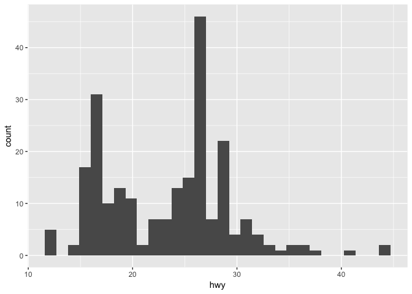

Visualize Data (solutions)
================

<!-- This file by Charlotte Wickham is licensed under a Creative Commons Attribution 4.0 International License, adapted from the orignal work at https://github.com/rstudio/master-the-tidyverse by RStudio. -->
``` r
library(tidyverse)
```

``` r
mpg
```

    ## # A tibble: 234 x 11
    ##    manufacturer      model displ  year   cyl      trans   drv   cty   hwy
    ##           <chr>      <chr> <dbl> <int> <int>      <chr> <chr> <int> <int>
    ##  1         audi         a4   1.8  1999     4   auto(l5)     f    18    29
    ##  2         audi         a4   1.8  1999     4 manual(m5)     f    21    29
    ##  3         audi         a4   2.0  2008     4 manual(m6)     f    20    31
    ##  4         audi         a4   2.0  2008     4   auto(av)     f    21    30
    ##  5         audi         a4   2.8  1999     6   auto(l5)     f    16    26
    ##  6         audi         a4   2.8  1999     6 manual(m5)     f    18    26
    ##  7         audi         a4   3.1  2008     6   auto(av)     f    18    27
    ##  8         audi a4 quattro   1.8  1999     4 manual(m5)     4    18    26
    ##  9         audi a4 quattro   1.8  1999     4   auto(l5)     4    16    25
    ## 10         audi a4 quattro   2.0  2008     4 manual(m6)     4    20    28
    ## # ... with 224 more rows, and 2 more variables: fl <chr>, class <chr>

Your Turn 1
-----------

Run the code on the slide to make a graph. Pay strict attention to spelling, capitalization, and parentheses!

``` r
ggplot(data = mpg) +
  geom_point(mapping = aes(x = displ, y = hwy))
```


Your Turn 2
-----------

Add `color`, `size`, `alpha`, and `shape` aesthetics to your graph. Experiment.

``` r
ggplot(mpg) + geom_point(aes(x = displ, y = hwy, color = class))
```


``` r
ggplot(mpg) + geom_point(aes(x = displ, y = hwy, size = class))
```

    ## Warning: Using size for a discrete variable is not advised.


``` r
ggplot(mpg) + geom_point(aes(x = displ, y = hwy, shape = class))
```

    ## Warning: The shape palette can deal with a maximum of 6 discrete values
    ## because more than 6 becomes difficult to discriminate; you have 7.
    ## Consider specifying shapes manually if you must have them.

    ## Warning: Removed 62 rows containing missing values (geom_point).


``` r
ggplot(mpg) + geom_point(aes(x = displ, y = hwy, alpha = class))
```


Your Turn 3
-----------

Replace this scatterplot with one that draws boxplots. Use the cheatsheet. Try your best guess.

``` r
ggplot(data = mpg) +
  geom_boxplot(mapping = aes(x = class, y = hwy))
```


Your Turn 4
-----------

Make a histogram of the `hwy` variable from `mpg`.

``` r
ggplot(data = mpg) +
  geom_histogram(mapping = aes(x = hwy))
```

    ## `stat_bin()` using `bins = 30`. Pick better value with `binwidth`.



Your Turn 5
-----------

Make a density plot of `hwy` colored by `class`.

``` r
ggplot(data = mpg) +
  geom_density(mapping = aes(x = hwy, color = class))
```


Your Turn 6
-----------

Make a bar chart `hwy` colored by `class`.

``` r
ggplot(data = mpg) +
  geom_bar(mapping = aes(x = class, fill = class))
```


Your Turn 7
-----------

Predict what this code will do. Then run it.

``` r
ggplot(mpg) + 
  geom_point(aes(displ, hwy)) +
  geom_smooth(aes(displ, hwy))
```

    ## `geom_smooth()` using method = 'loess'


Your Turn 8
-----------

What does `getwd()` return?

``` r
getwd()
```

    ## [1] "/Users/wickhamc/Documents/Projects/BC_Stats/solutions"

`getwd()` returns your current working directory. Using RStudio projects is the best way to control where this is. If you opened RStudio from the `r_intro_bc_stats.Rproj` file your current working directory should end with `/r_intro_bc_stats`.

Your Turn 9
-----------

Save the last plot and then locate it in the files pane.

``` r
ggsave("my-last-plot.png")
```

    ## Saving 7 x 5 in image

    ## `geom_smooth()` using method = 'loess'

------------------------------------------------------------------------

Take aways
==========

You can use this code template to make thousands of graphs with **ggplot2**.

``` r
ggplot(data = <DATA>) +
  <GEOM_FUNCTION>(mapping = aes(<MAPPINGS>))
```
