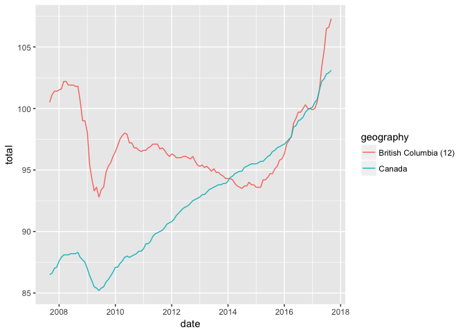
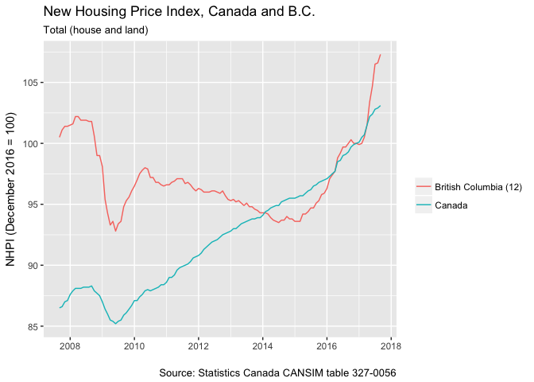
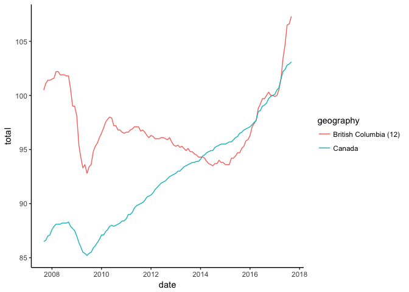
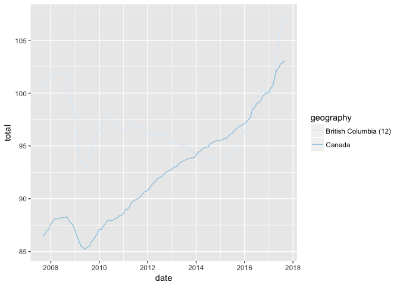
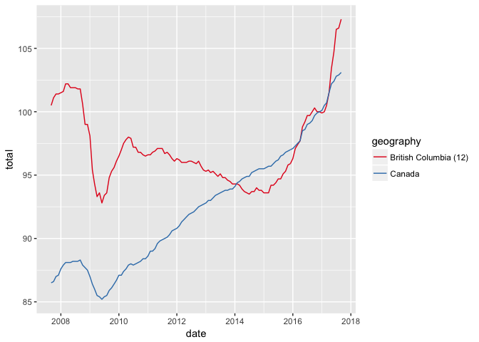
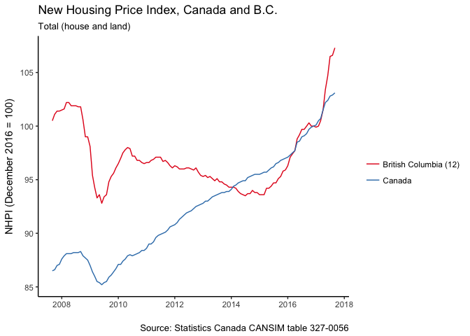
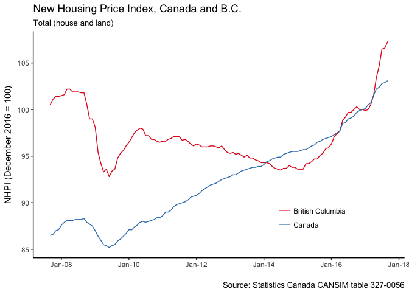

Visualizing New House Price Index
================

<!-- This file by Charlotte Wickham is licensed under a Creative Commons Attribution 4.0 International License. -->
``` r
library(tidyverse)
housing <- read_csv("data/housing_bc.csv")
```

    ## Parsed with column specification:
    ## cols(
    ##   geography = col_character(),
    ##   date = col_datetime(format = ""),
    ##   total = col_double()
    ## )

``` r
diamonds_plot <- ggplot(data = diamonds) +
  geom_bar(mapping = aes(x = cut, fill = clarity)) 
```

Your turn 1
-----------

``` r
basic_plot <- housing %>%
  filter(geography %in% c("Canada", "British Columbia (12)")) %>%
  ggplot(mapping = aes(x = date, y = total)) +
    geom_line(aes(color = geography))
basic_plot
```



Your turn 2
-----------

I've applied the diamond labels to the housing price plot. Edit the code to add appropriate labelling to the house price plot.

``` r
basic_plot + 
  labs(title = "New Housing Price Index, Canada and B.C.",
       subtitle = "Total (house and land)",
       x = "",
       y = "NHPI (December 2016 = 100)",
       color = "",
       caption = "Source: Statistics Canada CANSIM table 327-0056"
  )
```



Your turn 3
-----------

Add a theme to basic\_plot. Try a few and pick one you like.

``` r
basic_plot + theme_classic()
```



Your turn 4
-----------

Add a brewer scale to the basic\_plot.

``` r
basic_plot + scale_color_brewer()
```



Your turn 5
-----------

Choose a better color palette for the brewer scale.

``` r
basic_plot + scale_color_brewer(palette = "Set1")
```



Your turn 6
-----------

Put the labels, theme and scale changes together for basic\_plot.

What is left to change?

``` r
basic_plot +
  labs(title = "New Housing Price Index, Canada and B.C.",
       subtitle = "Total (house and land)",
       x = "",
       y = "NHPI (December 2016 = 100)",
       color = "",
       caption = "Source: Statistics Canada CANSIM table 327-0056"
  ) + 
  theme_classic() + 
  scale_color_brewer(palette = "Set1")
```



Final plot
----------

``` r
basic_plot +
  labs(title = "New Housing Price Index, Canada and B.C.",
       subtitle = "Total (house and land)",
       x = "",
       y = "NHPI (December 2016 = 100)",
       color = "",
       caption = "Source: Statistics Canada CANSIM table 327-0056"
  ) + 
  theme_classic() + 
  scale_color_brewer(palette = "Set1", 
    labels = c("British Columbia (12)" = "British Columbia",
               "Canada" = "Canada")) +
  scale_x_datetime(date_labels = "%b-%y") +
  theme(legend.position = c(0.75, 0.2))
```



Takeaways
---------

Every visual element on a ggplot plot can be controlled. The most frequent changes you want to make are to:

-   Labels, `+ labs()`
-   Themes, `+ theme_bw()`
-   Scales `+ scale_*_*()`
