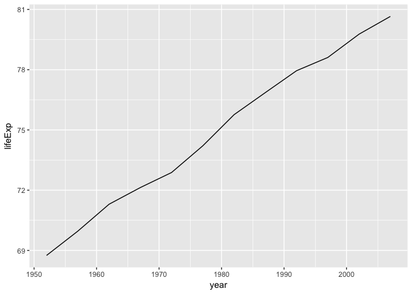
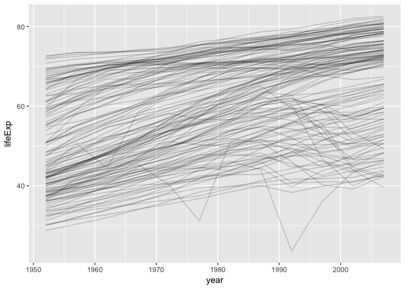

Modelling & Broom (solutions)
================

<!-- This file by Charlotte Wickham is licensed under a Creative Commons Attribution 4.0 International License. -->
``` r
library(gapminder)
library(tidyverse)
library(broom)
```

Your turn 1
-----------

Run the code chunk.

Take another look at life expectancy over time for Canada. What do you notice?

``` r
canada <- gapminder %>%
  filter(country == "Canada")

ggplot(canada) +
  geom_line(mapping = aes(x = year, y = lifeExp))
```



Your turn 2
-----------

``` r
canada_lm <- lm(lifeExp ~ year, data = canada)
canada_lm
```

    ## 
    ## Call:
    ## lm(formula = lifeExp ~ year, data = canada)
    ## 
    ## Coefficients:
    ## (Intercept)         year  
    ##   -358.3489       0.2189

``` r
summary(canada_lm)
```

    ## 
    ## Call:
    ## lm(formula = lifeExp ~ year, data = canada)
    ## 
    ## Residuals:
    ##     Min      1Q  Median      3Q     Max 
    ## -0.3812 -0.1368 -0.0471  0.2481  0.3157 
    ## 
    ## Coefficients:
    ##               Estimate Std. Error t value Pr(>|t|)    
    ## (Intercept) -3.583e+02  8.252e+00  -43.42 1.01e-12 ***
    ## year         2.189e-01  4.169e-03   52.50 1.52e-13 ***
    ## ---
    ## Signif. codes:  0 '***' 0.001 '**' 0.01 '*' 0.05 '.' 0.1 ' ' 1
    ## 
    ## Residual standard error: 0.2492 on 10 degrees of freedom
    ## Multiple R-squared:  0.9964, Adjusted R-squared:  0.996 
    ## F-statistic:  2757 on 1 and 10 DF,  p-value: 1.521e-13

Your turn 3
-----------

Look at the output of canada\_lm %&gt;% glance() Use dplyr tools to extract the R-squared for the model.

``` r
canada_lm %>% glance() %>% pull(r.squared)
```

    ## [1] 0.9963855

Your turn 4
-----------

How has life expectancy changed in other countries? Make a line plot of lifeExp vs. year grouped by country.
Set alpha to 0.2, to see the results better.

``` r
ggplot(gapminder, mapping = aes(x = year, y = lifeExp, group = country)) +
  geom_line(alpha = 0.2)
```


