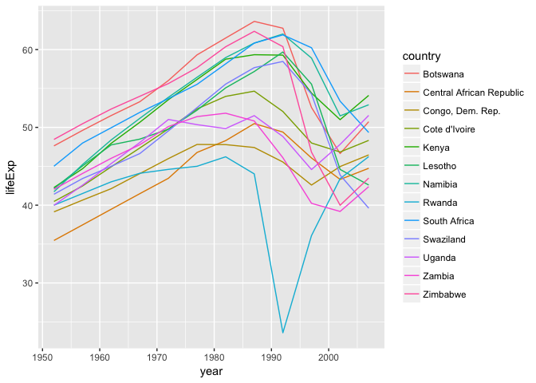
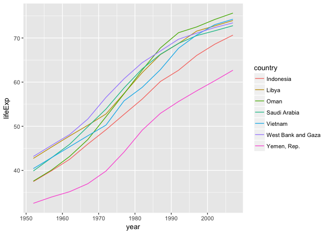

Iteration and List Columns (solutions)
================

<!-- This file by Charlotte Wickham is licensed under a Creative Commons Attribution 4.0 International License. -->
``` r
library(tidyverse)
library(gapminder)
library(broom)

nz <- gapminder %>%
  filter(country == "New Zealand")
canada <- gapminder %>%
  filter(country == "Canada")
us <- gapminder %>%
  filter(country == "United States")

# A complicated object to play with
three_models <- list(
  lm(lifeExp ~ year, data = nz),
  lm(lifeExp ~ year, data = canada),
  lm(lifeExp ~ year, data = us)
)
```

Iteration
=========

Your turn 1
-----------

Run the setup chunk. Look for `three_models` in your environment. Click on it to open a Viewer. What kind of object is this? Does its contents look familiar?

``` r
View(three_models)
```

`three_models` is a list! It has three elements, each one is the output from `lm()`, i.e. a regression model object.

Your Turn 2
-----------

Do it for one element: add some code to tidy nz\_model.

``` r
nz_model <- three_models[[1]]
nz_model %>% tidy()
```

    ## # A tibble: 2 x 5
    ##          term    estimate   std.error statistic      p.value
    ##         <chr>       <dbl>       <dbl>     <dbl>        <dbl>
    ## 1 (Intercept) -307.699628 26.63038965 -11.55445 4.166460e-07
    ## 2        year    0.192821  0.01345258  14.33339 5.407324e-08

Your turn 3
-----------

Run the code, what kind of object is `tidy_models`?

``` r
tidy_models <- map(three_models, ~ .x %>% tidy())
tidy_models
```

    ## [[1]]
    ##          term    estimate   std.error statistic      p.value
    ## 1 (Intercept) -307.699628 26.63038965 -11.55445 4.166460e-07
    ## 2        year    0.192821  0.01345258  14.33339 5.407324e-08
    ## 
    ## [[2]]
    ##          term     estimate   std.error statistic      p.value
    ## 1 (Intercept) -358.3488923 8.252132349 -43.42501 1.007334e-12
    ## 2        year    0.2188692 0.004168638  52.50378 1.520503e-13
    ## 
    ## [[3]]
    ##          term     estimate    std.error statistic      p.value
    ## 1 (Intercept) -291.0844923 13.777395873 -21.12769 1.254513e-09
    ## 2        year    0.1841692  0.006959774  26.46196 1.369788e-10

``` r
View(tidy_models)
```

Your turn 4
-----------

Edit the code to instead get the r.squared for each model.

``` r
map_dbl(three_models, ~ glance(.x) %>% 
                       pull(r.squared)
)
```

    ## [1] 0.9535846 0.9963855 0.9859202

List columns
============

``` r
gapminder_nested <- gapminder %>% 
  group_by(country) %>% 
  nest()
```

Your turn 5
-----------

Run the chunk: it pulls out the data column into data\_column. Use the object explorer (i.e. the magnifying glass in the Environment pane)mto take a look at `data_column`. What kind of object is it?

``` r
data_column <- gapminder_nested %>% pull(data) 
View(data_column)
```

Following along in slides:

``` r
# Add the models to a model column by mapping over data
gapminder_nested <- gapminder_nested %>% 
  mutate(model = map(data, ~ lm(lifeExp ~ year, data = .x)))

# Create the r-squared column, by mapping over model
gapminder_nested <- gapminder_nested %>% 
  mutate(r.squared = map_dbl(model, 
                        ~ glance(.x) %>% pull(r.squared)))
```

Your turn 6
-----------

Filter `gapminder_nested` to find the countries with R-squared less than 0.5

``` r
gapminder_nested %>% filter(r.squared < 0.5)
```

    ## # A tibble: 13 x 4
    ##                     country              data    model  r.squared
    ##                      <fctr>            <list>   <list>      <dbl>
    ##  1                 Botswana <tibble [12 x 5]> <S3: lm> 0.03402340
    ##  2 Central African Republic <tibble [12 x 5]> <S3: lm> 0.49324448
    ##  3         Congo, Dem. Rep. <tibble [12 x 5]> <S3: lm> 0.34820278
    ##  4            Cote d'Ivoire <tibble [12 x 5]> <S3: lm> 0.28337240
    ##  5                    Kenya <tibble [12 x 5]> <S3: lm> 0.44255729
    ##  6                  Lesotho <tibble [12 x 5]> <S3: lm> 0.08485635
    ##  7                  Namibia <tibble [12 x 5]> <S3: lm> 0.43702163
    ##  8                   Rwanda <tibble [12 x 5]> <S3: lm> 0.01715964
    ##  9             South Africa <tibble [12 x 5]> <S3: lm> 0.31246865
    ## 10                Swaziland <tibble [12 x 5]> <S3: lm> 0.06821087
    ## 11                   Uganda <tibble [12 x 5]> <S3: lm> 0.34215382
    ## 12                   Zambia <tibble [12 x 5]> <S3: lm> 0.05983644
    ## 13                 Zimbabwe <tibble [12 x 5]> <S3: lm> 0.05623196

Following along with slides:

``` r
gapminder_nested %>% 
  filter(r.squared < 0.5) %>%
  unnest(data) %>%
  ggplot(aes(x = year, y = lifeExp)) + 
    geom_line(aes(color = country))
```



Your Turn 7
-----------

Write code to:

-   Add a column to `gapminder_nested` with the slope coefficient from the model
-   Filter to find countries with a slope above 0.6 years/year.
-   Plot these countries over time.

``` r
gapminder_nested <- gapminder_nested %>% 
  mutate(slope = map_dbl(model, ~ .x %>% 
                                  tidy() %>% 
                                  filter(term == "year") %>% 
                                  pull(estimate)))
gapminder_nested %>% 
  filter(slope > 0.60) %>%
  unnest(data) %>%
  ggplot(aes(x = year, y = lifeExp)) + 
    geom_line(aes(color = country))
```


