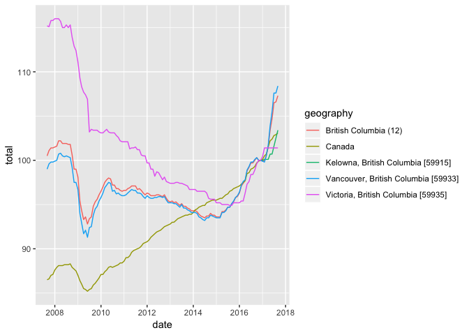

Visualizing New House Price Index
================

``` r
library(tidyverse)
```

Import
======

Grabbing some cleaned up data

``` r
housing <- read_csv("data/housing_bc.csv")
```

    ## Parsed with column specification:
    ## cols(
    ##   geography = col_character(),
    ##   date = col_datetime(format = ""),
    ##   total = col_double()
    ## )

``` r
housing
```

    ## # A tibble: 605 x 3
    ##                geography       date total
    ##                    <chr>     <dttm> <dbl>
    ##  1 British Columbia (12) 2008-04-01 102.2
    ##  2 British Columbia (12) 2009-04-01  93.3
    ##  3 British Columbia (12) 2010-04-01  97.8
    ##  4 British Columbia (12) 2011-04-01  96.9
    ##  5 British Columbia (12) 2012-04-01  96.0
    ##  6 British Columbia (12) 2013-04-01  95.3
    ##  7 British Columbia (12) 2014-04-01  93.9
    ##  8 British Columbia (12) 2015-04-01  94.2
    ##  9 British Columbia (12) 2016-04-01  97.7
    ## 10 British Columbia (12) 2017-04-01 101.5
    ## # ... with 595 more rows

Visualize
=========

Your turn
---------

Write code to imitate the plot at: <https://www2.gov.bc.ca/gov/content/data/statistics/infoline/infoline-2017/17-146-price-new-housing>


``` r
ggplot(data = housing) +
  geom_line(aes(x = date, y = total, color = geography))
```

    ## Warning: Removed 111 rows containing missing values (geom_path).



The plot still needs some polishing, we'll work on that in 06-Polishing-plots.
