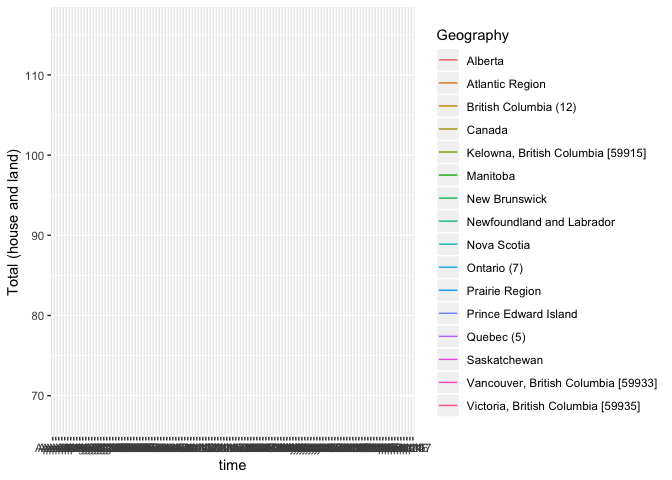
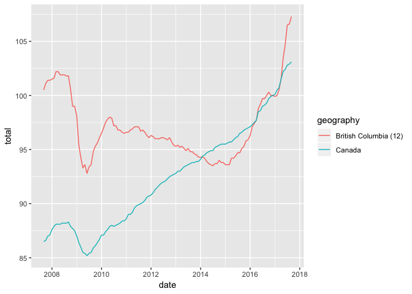

Tidying New House Price Index
================

``` r
library(tidyverse)
```

    ## ── Attaching packages ──────────────────────────────────────────────── tidyverse 1.2.1 ──

    ## ✔ ggplot2 3.0.0     ✔ purrr   0.2.5
    ## ✔ tibble  1.4.2     ✔ dplyr   0.7.5
    ## ✔ tidyr   0.8.1     ✔ stringr 1.3.1
    ## ✔ readr   1.1.1     ✔ forcats 0.3.0

    ## ── Conflicts ─────────────────────────────────────────────────── tidyverse_conflicts() ──
    ## ✖ dplyr::filter() masks stats::filter()
    ## ✖ dplyr::lag()    masks stats::lag()

Importing raw(er) data
======================

``` r
housing_raw <- read_csv("data/housing_raw.csv")
```

    ## Parsed with column specification:
    ## cols(
    ##   .default = col_double(),
    ##   Geography = col_character(),
    ##   `New housing price indexes` = col_character(),
    ##   `Dec-16` = col_integer()
    ## )

    ## See spec(...) for full column specifications.

Tidying data
============

Your turn
---------

Brainstorm with neighbor: What needs to happen to `housing_raw` to get it in a form to plot?

``` r
housing_raw
```

    ## # A tibble: 48 x 123
    ##    Geography `New housing pr… `Sep-07` `Oct-07` `Nov-07` `Dec-07` `Jan-08`
    ##    <chr>     <chr>               <dbl>    <dbl>    <dbl>    <dbl>    <dbl>
    ##  1 Canada    Total (house an…     86.5     86.6     87       87.1     87.6
    ##  2 Canada    House only           85.1     85.1     85.5     85.6     86.1
    ##  3 Canada    Land only            90       90.3     90.7     90.9     91.4
    ##  4 Atlantic… Total (house an…     80.4     80.7     81.8     82.1     82.9
    ##  5 Atlantic… House only           82.5     82.7     83.9     84.2     85.1
    ##  6 Atlantic… Land only            73.5     73.8     74.9     75.3     75.9
    ##  7 Newfound… Total (house an…     67.3     67.9     68.3     69.2     69.9
    ##  8 Newfound… House only           70.6     71.1     71.8     72.6     73.5
    ##  9 Newfound… Land only            59.8     60.3     60.3     61.3     61.6
    ## 10 Prince E… Total (house an…     97.6     97.6     98.4     98.4     99.7
    ## # ... with 38 more rows, and 116 more variables: `Feb-08` <dbl>,
    ## #   `Mar-08` <dbl>, `Apr-08` <dbl>, `May-08` <dbl>, `Jun-08` <dbl>,
    ## #   `Jul-08` <dbl>, `Aug-08` <dbl>, `Sep-08` <dbl>, `Oct-08` <dbl>,
    ## #   `Nov-08` <dbl>, `Dec-08` <dbl>, `Jan-09` <dbl>, `Feb-09` <dbl>,
    ## #   `Mar-09` <dbl>, `Apr-09` <dbl>, `May-09` <dbl>, `Jun-09` <dbl>,
    ## #   `Jul-09` <dbl>, `Aug-09` <dbl>, `Sep-09` <dbl>, `Oct-09` <dbl>,
    ## #   `Nov-09` <dbl>, `Dec-09` <dbl>, `Jan-10` <dbl>, `Feb-10` <dbl>,
    ## #   `Mar-10` <dbl>, `Apr-10` <dbl>, `May-10` <dbl>, `Jun-10` <dbl>,
    ## #   `Jul-10` <dbl>, `Aug-10` <dbl>, `Sep-10` <dbl>, `Oct-10` <dbl>,
    ## #   `Nov-10` <dbl>, `Dec-10` <dbl>, `Jan-11` <dbl>, `Feb-11` <dbl>,
    ## #   `Mar-11` <dbl>, `Apr-11` <dbl>, `May-11` <dbl>, `Jun-11` <dbl>,
    ## #   `Jul-11` <dbl>, `Aug-11` <dbl>, `Sep-11` <dbl>, `Oct-11` <dbl>,
    ## #   `Nov-11` <dbl>, `Dec-11` <dbl>, `Jan-12` <dbl>, `Feb-12` <dbl>,
    ## #   `Mar-12` <dbl>, `Apr-12` <dbl>, `May-12` <dbl>, `Jun-12` <dbl>,
    ## #   `Jul-12` <dbl>, `Aug-12` <dbl>, `Sep-12` <dbl>, `Oct-12` <dbl>,
    ## #   `Nov-12` <dbl>, `Dec-12` <dbl>, `Jan-13` <dbl>, `Feb-13` <dbl>,
    ## #   `Mar-13` <dbl>, `Apr-13` <dbl>, `May-13` <dbl>, `Jun-13` <dbl>,
    ## #   `Jul-13` <dbl>, `Aug-13` <dbl>, `Sep-13` <dbl>, `Oct-13` <dbl>,
    ## #   `Nov-13` <dbl>, `Dec-13` <dbl>, `Jan-14` <dbl>, `Feb-14` <dbl>,
    ## #   `Mar-14` <dbl>, `Apr-14` <dbl>, `May-14` <dbl>, `Jun-14` <dbl>,
    ## #   `Jul-14` <dbl>, `Aug-14` <dbl>, `Sep-14` <dbl>, `Oct-14` <dbl>,
    ## #   `Nov-14` <dbl>, `Dec-14` <dbl>, `Jan-15` <dbl>, `Feb-15` <dbl>,
    ## #   `Mar-15` <dbl>, `Apr-15` <dbl>, `May-15` <dbl>, `Jun-15` <dbl>,
    ## #   `Jul-15` <dbl>, `Aug-15` <dbl>, `Sep-15` <dbl>, `Oct-15` <dbl>,
    ## #   `Nov-15` <dbl>, `Dec-15` <dbl>, `Jan-16` <dbl>, `Feb-16` <dbl>,
    ## #   `Mar-16` <dbl>, `Apr-16` <dbl>, `May-16` <dbl>, …

Your turn
---------

Try to tidy `housing_raw` don't forget your cheatsheet.

``` r
housing_reshaped <- housing_raw %>% 
  gather(key = "time", value = "hpi", 
    -Geography, -`New housing price indexes`) %>%
  spread(`New housing price indexes`, hpi) 

housing_reshaped
```

    ## # A tibble: 1,936 x 5
    ##    Geography time   `House only` `Land only` `Total (house and land)`
    ##    <chr>     <chr>         <dbl>       <dbl>                    <dbl>
    ##  1 Alberta   Apr-08        104.        101.                     103. 
    ##  2 Alberta   Apr-09         90.1        95.1                     91.7
    ##  3 Alberta   Apr-10         93.3        91.1                     92.6
    ##  4 Alberta   Apr-11         92.5        92.9                     92.7
    ##  5 Alberta   Apr-12         93.8        93.8                     93.7
    ##  6 Alberta   Apr-13         96.9        94.7                     96.1
    ##  7 Alberta   Apr-14        101.         96.7                     99.3
    ##  8 Alberta   Apr-15        102.         98.7                    101. 
    ##  9 Alberta   Apr-16        101.         98.9                    100. 
    ## 10 Alberta   Apr-17        100          99.7                     99.9
    ## # ... with 1,926 more rows

Data looks to be in the right shape, but plotting shows some problems:

``` r
ggplot(housing_reshaped) +
  geom_line(aes(x = time, y = `Total (house and land)`, color = Geography))
```

    ## Warning: Removed 111 rows containing missing values (geom_path).

    ## geom_path: Each group consists of only one observation. Do you need to
    ## adjust the group aesthetic?



Problems:

-   `time` is a character string, rather than a date
-   `Geography` still contatins too many regions
-   and it's painful to refer to a column with spaces in it.

Fixes:

``` r
housing_bc <- housing_reshaped %>%
  mutate(date = lubridate::parse_date_time(time, order = "my")) %>%
  filter(Geography %in% c("Canada", "British Columbia (12)")) %>%
  rename(total = "Total (house and land)",
         land = "Land only",
         house = "House only",
         geography = Geography)
```

Then we can plot:

``` r
ggplot(housing_bc) +
  geom_line(aes(x = date, y = total, color = geography))
```


